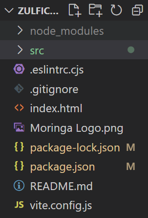
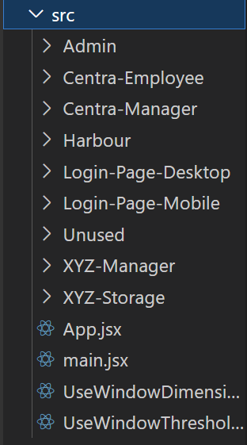
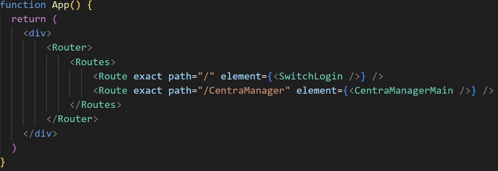

# Our Primary Repository For Final Project

Please Push all your code into this repo under the src folder
add your part with a folder with assets, components, and styles.

And add all your modules using npm install on the primary repo dont copy any files that are already there.

To download the repo please use git clone or git pull so you have access to all the files and are able to push to the repository

How to copy the repository (Make sure to be in an Empty Folder) :
1. Create a local github repository using git init
```
git init
```
2. Then use set the github remote link
```
git remote add origin https://github.com/WADSFinalProject/Final-Project-Primary-ZulfiCuan/
```
3. Then pull the repository using git pull
```
git pull
```
4. Then switch branches to the master branch
```
git checkout master
```
5. Then you should see all the files there

# Remember to add all files into the src folder and add all necessary files if you have too


Here and Add necessary files outside



Make sure to create your folder here and follow this if possible



Then add the routes here in the app.jsx file
